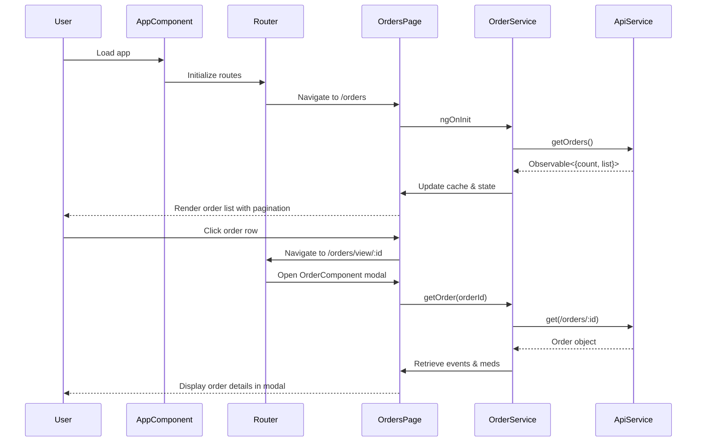
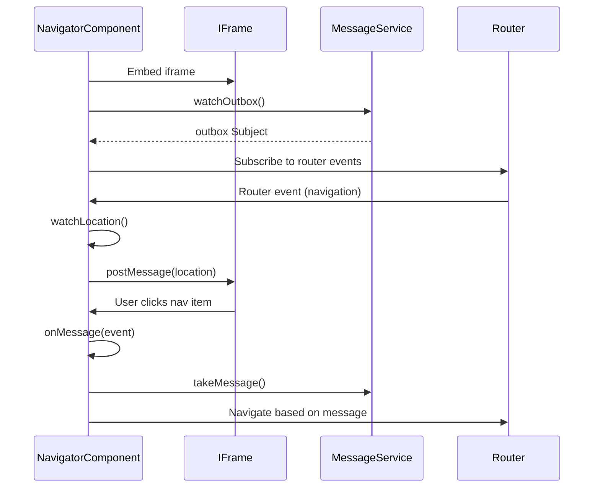

# Angular 7.2 Architecture Guide

This document explains how Angular 7.2 works in this application, including key concepts, patterns, and implementation details.

## Table of Contents

1. [Angular Framework Overview](#angular-framework-overview)
2. [Module System](#module-system)
3. [Component Architecture](#component-architecture)
4. [Services and Dependency Injection](#services-and-dependency-injection)
5. [Routing](#routing)
6. [Data Binding](#data-binding)
7. [HTTP Communication](#http-communication)
8. [RxJS and Observables](#rxjs-and-observables)
9. [Forms and Validation](#forms-and-validation)
10. [Application Lifecycle](#application-lifecycle)

---

## Angular Framework Overview

Angular 7.2 is a TypeScript-based web application framework that follows the **MVC (Model-View-Controller)** pattern, though Angular calls it **Component-Based Architecture**.

### Key Concepts

- **Components** - Building blocks of the UI
- **Modules** - Containers for related code
- **Services** - Reusable business logic
- **Dependency Injection** - Pattern for providing dependencies
- **Templates** - HTML views with Angular directives
- **Directives** - Extend HTML functionality
- **Pipes** - Transform data in templates

---

## Module System

### Root Module (`app.module.ts`)

Every Angular application has at least one module - the **root module**. This module bootstraps the application.

```typescript
@NgModule({
  declarations: [
    // Components, directives, pipes used in this module
    AppComponent,
    OrdersComponent,
    // ...
  ],
  imports: [
    // Other modules this module depends on
    BrowserModule,
    FormsModule,
    HttpModule,
    AppRoutingModule,
    NgbModule,
    // ...
  ],
  providers: [
    // Services available throughout the app
    ApiService,
    UserService,
    OrderService,
    // ...
  ],
  bootstrap: [
    // Root component to bootstrap
    AppComponent
  ]
})
export class AppModule { }
```

### Module Metadata

- **declarations** - Components, directives, and pipes that belong to this module
- **imports** - Other modules whose exported classes are needed
- **providers** - Service creators that make services available app-wide
- **bootstrap** - The root component Angular creates and inserts into `index.html`

### Feature Modules

While this app uses a single module, larger apps can split into feature modules:
- `OrdersModule` - Everything related to orders
- `AdminModule` - Admin functionality
- `SharedModule` - Shared components/services

---

## Component Architecture

### Component Anatomy

A component consists of:

1. **TypeScript Class** - Logic and data
2. **HTML Template** - View structure
3. **CSS/SCSS Styles** - Component styling
4. **Metadata Decorator** - Configuration

### Example: OrdersComponent

**orders.component.ts** (Class + Metadata):
```typescript
@Component({
  selector: 'app-orders',              // HTML tag: <app-orders>
  templateUrl: './orders.component.html', // External template
  styleUrls: ['./orders.component.scss']  // Component styles
})
export class OrdersComponent implements OnInit {
  // Component properties (model)
  orders: Order[] = [];
  searchText: string = '';

  // Constructor with dependency injection
  constructor(
    private orderService: OrderService,
    private router: Router
  ) { }

  // Lifecycle hook - runs after component initialization
  ngOnInit() {
    this.loadOrders();
  }

  // Component methods
  loadOrders() {
    this.orderService.search(this.searchText)
      .subscribe(orders => this.orders = orders);
  }
}
```

**orders.component.html** (Template):
```html
<div class="orders-container">
  <!-- Property binding: [value] -->
  <input [value]="searchText"
         (input)="onSearchChange($event)">

  <!-- Structural directive: *ngFor -->
  <div *ngFor="let order of orders">
    <!-- Interpolation: {{ }} -->
    <h3>{{ order.accessionId }}</h3>

    <!-- Event binding: (click) -->
    <button (click)="viewOrder(order.id)">View</button>
  </div>
</div>
```

### Component Lifecycle Hooks

Angular calls these methods at specific times:

```typescript
export class OrdersComponent implements OnInit, OnDestroy {
  constructor() {
    // 1. Constructor called (NOT a lifecycle hook)
  }

  ngOnInit() {
    // 2. After component initialization
    // Best place to fetch data
  }

  ngOnChanges(changes: SimpleChanges) {
    // Called when @Input properties change
  }

  ngOnDestroy() {
    // 3. Before component destruction
    // Clean up subscriptions, timers, etc.
  }
}
```

### Component Communication

**Parent to Child** - `@Input()`:
```typescript
// Child component
export class PatientComponent {
  @Input() patient: Patient;
}

// Parent template
<app-patient [patient]="selectedPatient"></app-patient>
```

**Child to Parent** - `@Output()`:
```typescript
// Child component
export class PatientComponent {
  @Output() save = new EventEmitter<Patient>();

  onSave() {
    this.save.emit(this.patient);
  }
}

// Parent template
<app-patient (save)="handleSave($event)"></app-patient>
```

---

## Services and Dependency Injection

### Service Pattern

Services are singleton classes that provide reusable functionality across components.

```typescript
@Injectable({
  providedIn: 'root'  // Available app-wide
})
export class OrderService {
  private orders: Order[] = [];

  constructor(private api: ApiService) { }

  getOrder(id: number): Observable<Order> {
    return this.api.get(`/demo/order/view/${id}`);
  }
}
```

### Dependency Injection (DI)

Angular's DI system provides dependencies to constructors:

```typescript
export class OrdersComponent {
  // Angular sees these types and injects instances
  constructor(
    private orderService: OrderService,  // Injected
    private router: Router,              // Injected
    private route: ActivatedRoute        // Injected
  ) { }
}
```

**How It Works:**

1. Service registered in `providers` array or `@Injectable({ providedIn: 'root' })`
2. Angular creates a singleton instance
3. Angular injects the same instance wherever needed
4. Services can depend on other services

### Service Hierarchy

```
AppModule
├── ApiService (root)
│   ├── token: BehaviorSubject
│   └── http: Http
├── UserService
│   └── uses: ApiService
├── OrderService
│   └── uses: ApiService
└── AdminService
    └── uses: ApiService
```

---

## Routing

### Router Configuration (`app-routing.module.ts`)

```typescript
const routes: Routes = [
  { path: '', redirectTo: '/orders', pathMatch: 'full' },
  { path: 'orders', component: OrdersComponent, children: [
    { path: 'new', component: NewOrderComponent },
    { path: 'view/:orderId', component: OrderComponent }
  ]},
  { path: 'admin', component: AdminComponent, children: [
    { path: 'order-sets', component: OrderSetsComponent, children: [...] },
    { path: 'med-sets', component: MedSetsComponent, children: [...] },
    // ...
  ]}
];

@NgModule({
  imports: [RouterModule.forRoot(routes)],
  exports: [RouterModule]
})
export class AppRoutingModule { }
```

### Navigation Methods

**In Template:**
```html
<!-- routerLink directive -->
<a [routerLink]="['/orders']">Orders</a>
<a [routerLink]="['/orders', 'view', order.id]">View Order</a>

<!-- Router outlet - where child routes render -->
<router-outlet></router-outlet>
```

**In Component:**
```typescript
export class OrdersComponent {
  constructor(private router: Router) { }

  viewOrder(id: number) {
    // Imperative navigation
    this.router.navigate(['/orders', 'view', id]);
  }

  goBack() {
    // Navigate back in history
    this.router.navigate(['../'], { relativeTo: this.route });
  }
}
```

### Route Parameters

```typescript
export class OrderComponent implements OnInit {
  constructor(private route: ActivatedRoute) { }

  ngOnInit() {
    // Get route parameter
    this.route.params.subscribe(params => {
      const orderId = params['orderId'];
      this.loadOrder(orderId);
    });
  }
}
```

### Child Routes & Modal Pattern

This app uses child routes for modals:

```
/orders               → OrdersComponent (list)
/orders/new           → OrdersComponent + NewOrderComponent (modal)
/orders/view/123      → OrdersComponent + OrderComponent (modal)
```

Both the parent and child render simultaneously via `<router-outlet>`.

---

## Data Binding

Angular provides four types of binding:

### 1. Interpolation `{{ }}`

Displays component property in template:
```html
<h1>{{ order.accessionId }}</h1>
<p>Status: {{ order.status }}</p>
```

### 2. Property Binding `[property]`

Binds component property to element property:
```html
<input [value]="searchText">

<button [disabled]="!isValid">Submit</button>
```

### 3. Event Binding `(event)`

Binds element event to component method:
```html
<button (click)="saveOrder()">Save</button>
<input (input)="onSearchChange($event)">
<form (submit)="handleSubmit($event)">
```

### 4. Two-Way Binding `[(ngModel)]`

Combines property and event binding:
```html
<!-- Requires FormsModule -->
<input [(ngModel)]="searchText">

<!-- Equivalent to: -->
<input [ngModel]="searchText"
       (ngModelChange)="searchText = $event">
```

### Structural Directives

**`*ngIf`** - Conditionally add/remove element:
```html
<div *ngIf="order">
  Order found: {{ order.id }}
</div>

<div *ngIf="isLoading; else loadedContent">
  Loading...
</div>
<ng-template #loadedContent>
  <div>{{ orders.length }} orders found</div>
</ng-template>
```

**`*ngFor`** - Repeat element for each item:
```html
<div *ngFor="let order of orders; let i = index">
  {{ i + 1 }}. Order #{{ order.accessionId }}
</div>
```

**`*ngSwitch`** - Switch between multiple views:
```html
<div [ngSwitch]="order.status">
  <p *ngSwitchCase="'Received'">Order received</p>
  <p *ngSwitchCase="'Processing'">Processing order</p>
  <p *ngSwitchDefault>Unknown status</p>
</div>
```

---

## HTTP Communication

### The Old Way (This App) - `@angular/http`

**DEPRECATED** - This app uses the old HTTP module:

```typescript
import { Http } from '@angular/http';

export class ApiService {
  constructor(private http: Http) { }

  get(endpoint: string): Observable<any> {
    return this.http.get(this.baseUrl + endpoint)
      .map(response => response.json())  // Manual JSON parsing
      .catch(this.handleError);
  }
}
```

### The New Way - `@angular/common/http`

Modern Angular apps use `HttpClient`:

```typescript
import { HttpClient } from '@angular/common/http';

export class ApiService {
  constructor(private http: HttpClient) { }

  get(endpoint: string): Observable<any> {
    // Automatic JSON parsing
    return this.http.get(this.baseUrl + endpoint);
  }
}
```

### HTTP Interceptors (Not Used Here)

Modern approach uses interceptors for auth:

```typescript
@Injectable()
export class AuthInterceptor implements HttpInterceptor {
  intercept(req: HttpRequest<any>, next: HttpHandler) {
    const authReq = req.clone({
      setHeaders: { Authorization: `Bearer ${this.token}` }
    });
    return next.handle(authReq);
  }
}
```

---

## RxJS and Observables

### Observable Pattern

Observables are streams of data over time:

```typescript
// Create observable
const orders$: Observable<Order[]> = this.orderService.getOrders();

// Subscribe to receive data
orders$.subscribe(
  data => console.log('Orders:', data),   // Success
  error => console.error('Error:', error), // Error
  () => console.log('Complete')            // Complete
);
```

### Common RxJS Operators

**`map`** - Transform data:
```typescript
this.orderService.getOrders()
  .pipe(
    map(orders => orders.filter(o => o.status === 'Complete'))
  )
  .subscribe(completeOrders => { ... });
```

**`switchMap`** - Switch to new observable:
```typescript
this.searchText$
  .pipe(
    debounceTime(300),
    switchMap(term => this.orderService.search(term))
  )
  .subscribe(results => { ... });
```

**`debounceTime`** - Wait before emitting:
```typescript
searchTextChanged = new Subject<string>();

ngOnInit() {
  this.searchTextChanged
    .pipe(debounceTime(200))  // Wait 200ms after typing stops
    .subscribe(term => this.search(term));
}
```

**`distinctUntilChanged`** - Only emit if value changed:
```typescript
this.searchText$
  .pipe(distinctUntilChanged())  // Skip if same as previous
  .subscribe(term => this.search(term));
```

### Subjects

Subjects are both Observable and Observer:

```typescript
export class MessageService {
  // BehaviorSubject - stores current value
  private tokenSubject = new BehaviorSubject<string>(null);
  public token$ = this.tokenSubject.asObservable();

  setToken(token: string) {
    this.tokenSubject.next(token);  // Emit new value
  }
}
```

### Unsubscribing

Important to prevent memory leaks:

```typescript
export class OrdersComponent implements OnInit, OnDestroy {
  private subscription: Subscription;

  ngOnInit() {
    this.subscription = this.orderService.getOrders()
      .subscribe(orders => this.orders = orders);
  }

  ngOnDestroy() {
    // Clean up
    this.subscription.unsubscribe();
  }
}
```

---

## Forms and Validation

### Template-Driven Forms (Used in This App)

Forms defined in template with `ngModel`:

```html
<form #orderForm="ngForm" (submit)="onSubmit()">
  <input name="accessionId"
         [(ngModel)]="order.accessionId"
         required>

  <select name="status"
          [(ngModel)]="order.status">
    <option value="Received">Received</option>
    <option value="Processing">Processing</option>
  </select>

  <button [disabled]="!orderForm.valid">Submit</button>
</form>
```

### Form Validation

```html
<input name="email"
       [(ngModel)]="patient.email"
       #email="ngModel"
       required
       email>

<div *ngIf="email.invalid && email.touched">
  <span *ngIf="email.errors.required">Email required</span>
  <span *ngIf="email.errors.email">Invalid email</span>
</div>
```

### Reactive Forms (Alternative Approach)

Not used in this app, but more powerful:

```typescript
export class OrderComponent implements OnInit {
  orderForm: FormGroup;

  constructor(private fb: FormBuilder) { }

  ngOnInit() {
    this.orderForm = this.fb.group({
      accessionId: ['', Validators.required],
      status: ['Received'],
      patientId: ['', [Validators.required, Validators.min(1)]]
    });
  }

  onSubmit() {
    if (this.orderForm.valid) {
      console.log(this.orderForm.value);
    }
  }
}
```

---

## Application Lifecycle

### Bootstrap Sequence

1. **`main.ts`** - Entry point
```typescript
platformBrowserDynamic().bootstrapModule(AppModule)
  .catch(err => console.error(err));
```

2. **`app.module.ts`** - Root module loaded
```typescript
@NgModule({
  bootstrap: [AppComponent]  // Bootstrap root component
})
```

3. **`app.component.ts`** - Root component rendered
```typescript
@Component({
  selector: 'app-root',
  template: '<router-outlet></router-outlet>'
})
export class AppComponent implements OnInit {
  ngOnInit() {
    // App initialization logic
  }
}
```

4. **Router** - Initial navigation triggered
5. **Components** - Route components loaded and rendered

### Build Process

**Development Build** (`ng serve`):
1. TypeScript → JavaScript compilation
2. Template compilation
3. Bundling (webpack)
4. Dev server starts on port 4200
5. Live reload on file changes

**Production Build** (`ng build --prod`):
1. AOT (Ahead-of-Time) compilation
2. Tree shaking (remove unused code)
3. Minification
4. Uglification
5. Bundling optimized chunks
6. Output to `dist/` directory

---

## Key Patterns in This Application

### 1. Service Layer Pattern

All API communication goes through services:
```
Component → Service → ApiService → Backend API
```

### 2. Observable Data Services

Services expose observables that components subscribe to:
```typescript
// Service
getOrders(): Observable<Order[]> { ... }

// Component
this.orderService.getOrders().subscribe(orders => this.orders = orders);
```

### 3. Search with Debounce

Prevent excessive API calls during typing:
```typescript
searchTextChanged: Subject<string> = new Subject<string>();

ngOnInit() {
  this.searchTextChanged.pipe(
    debounceTime(200),
    distinctUntilChanged(),
    switchMap(term => this.orderService.search(term))
  ).subscribe(results => this.updateResults(results));
}
```

### 4. Modal via Child Routes

Modals render as child route components:
```
/orders → List view
/orders/new → List view + modal overlay
```

### 5. Caching Pattern

Services cache API responses:
```typescript
private cache: { [key: number]: Order } = {};

getOrder(id: number): Observable<Order> {
  if (this.cache[id]) {
    return of(this.cache[id]);  // Return cached
  }
  return this.api.get(`/order/${id}`).pipe(
    tap(order => this.cache[id] = order)
  );
}
```

---

## Sequence Diagrams

Visual representation of key application flows:

### Order Management Flow

This diagram shows the complete flow from loading the app to viewing order details:



**Key Takeaways:**
- Router handles navigation to pages and modals
- OrderService acts as intermediary between components and API
- Caching occurs in OrderService layer
- Modal rendered as child route component

### Navigator Component Communication

This diagram illustrates the iframe bridge communication pattern:



**Key Takeaways:**
- postMessage API enables cross-origin communication
- MessageService provides reactive Subject-based messaging
- NavigatorComponent bridges Angular router and iframe content
- Bidirectional communication: location sync and navigation

---

## Further Reading

- [Angular 7 Documentation](https://v7.angular.io/docs)
- [RxJS Documentation](https://rxjs.dev/guide/overview)
- [TypeScript Handbook](https://www.typescriptlang.org/docs/handbook/intro.html)
- [Angular Style Guide](https://v7.angular.io/guide/styleguide)
