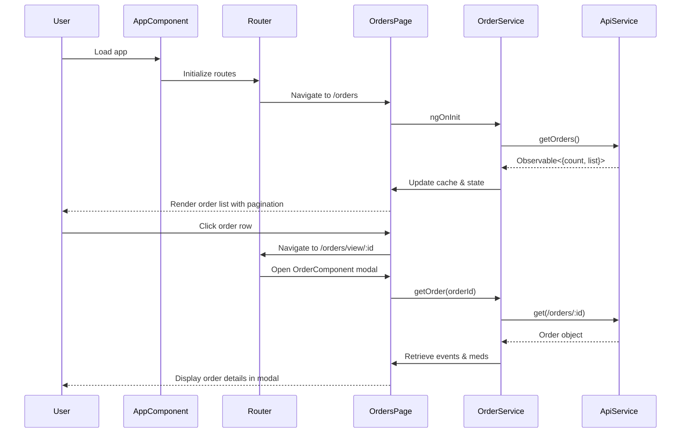
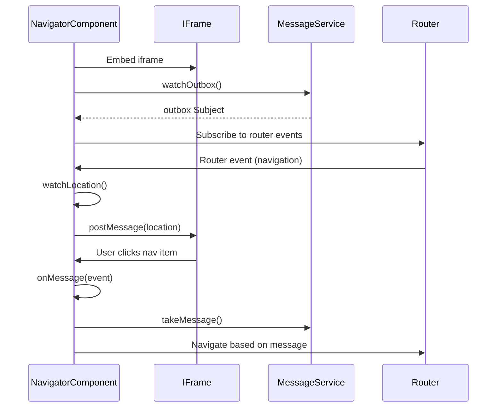

# Demo System - Angular Application

A medical demonstration system for managing patient orders, medications, test sets, and scheduled orders. Built with Angular 7.2 and integrates with a REST API backend.

## Overview

This application provides a web interface for:
- Creating and managing patient laboratory orders
- Tracking order status through the laboratory workflow
- Managing medication sets (CARD and SAMM reports)
- Configuring test order sets
- Managing patient information
- Setting up recurring scheduled orders

## Technology Stack

| Technology | Version | Purpose |
|------------|---------|---------|
| Angular | 7.2.x | Frontend framework |
| TypeScript | 3.2.2 | Type-safe JavaScript |
| RxJS | 6.3.3 | Reactive programming |
| Bootstrap | 4.3.1 | UI styling framework |
| ng-bootstrap | 4.1.2 | Bootstrap components for Angular |
vb | ng-select | 2.19.0 | Enhanced select dropdowns |
| Moment.js | 2.24.0 | Date/time manipulation |

## Project Structure

```
src/
├── app/
│   ├── classes/              # TypeScript data models
│   ├── services/             # Business logic and API integration
│   ├── components/           # Shared UI components
│   ├── pages/                # Page-level components
│   ├── modals/               # Modal dialog components
│   ├── app.module.ts         # Root module
│   └── app-routing.module.ts # Route configuration
├── environments/             # Environment configuration
└── assets/                   # Static assets
```

## Quick Start

### Prerequisites

- Node.js (v10.x or higher recommended)
- npm (v6.x or higher)
- Angular CLI 7.3.8

### Installation

```bash
# Install dependencies
npm install

# Start development server
ng serve

# Navigate to
http://localhost:4200/
```

### Build

```bash
# Development build
ng build
# Production build
ng build --prod

# Output directory
dist/demo-system/
```

## Application Features

### Orders Management (`/orders`)
- View all patient orders with search and filtering
- Create new orders with patient, doctor, location, and test selection
- Track order status (Received, In Process, Completed, etc.)
- View order details, events, and results
- Send orders to external systems (Copia, LIS)
- Print accession reports

### Admin Panel (`/admin`)

#### Order Sets (`/admin/order-sets`)
- Create and manage test order sets
- Configure test panels and profiles
- Associate results with order sets

#### Medication Sets (`/admin/med-sets`)
- Create CARD and SAMM medication sets
- Configure medication lists by template type
- Manage generic and brand medications

#### Patients (`/admin/patients`)
- Create and edit test patient records
- Search patients by name, ID, or demographics
- Manage patient contact information

#### Scheduled Orders (`/admin/recurring`)
- Set up recurring orders (weekly/monthly)
- Configure schedule timing
- Enable/disable scheduled orders

## API Integration

The application connects to a REST API backend:

**Base URL:** `https://jdwebapi01.dominiondiagnostics.com/`

**Authentication:** Bearer token (retrieved via login)

See [API_REFERENCE.md](./API_REFERENCE.md) for complete API documentation.

## Architecture

### Services Layer

- **ApiService** - HTTP client wrapper with token management
- **UserService** - Authentication and user management
- **OrderService** - Order operations and search
- **AdminService** - Admin panel operations
- **MedicationService** - Medication data management
- **MessageService** - Inter-component communication

### Component Architecture

- **Pages** - Top-level route components
- **Modals** - Dialog components for create/edit operations
- **Navigator** - iframe bridge for cross-origin communication

### Data Flow

1. User interacts with page component
2. Component calls service method
3. Service makes API request via ApiService
4. Response parsed and returned as Observable
5. Component updates view with data

### Sequence Diagrams

#### Order Management Flow



#### Navigator Component Communication



## Development

### Running Tests

```bash
# Unit tests
ng test

# E2E tests
ng e2e

# Code linting
ng lint
```

### Code Standards

- TypeScript strict mode enabled
- TSLint rules enforced
- Component/service separation
- Reactive patterns with RxJS

## Documentation

- [ANGULAR_GUIDE.md](./ANGULAR_GUIDE.md) - Angular 7.2 architecture guide
- [API_REFERENCE.md](./API_REFERENCE.md) - Complete API endpoint documentation
- [FILE_GUIDE.md](./FILE_GUIDE.md) - Detailed file-by-file guide

## Environment Configuration

Development environment variables are stored in `src/environments/environment.ts`:

```typescript
{
  production: false,
  api_url: 'https://jdwebapi01.dominiondiagnostics.com/',
  env_name: 'development',
  user_name: 'jdewar',
  password: '123connect?'
}
```

**Note:** Production credentials should be configured separately and never committed to version control.

## Browser Support

- Chrome (latest)
- Firefox (latest)
- Safari (latest)
- Edge (latest)

## License

Proprietary - Dominion Diagnostics

## Further Help

For Angular CLI help:
```bash
ng help
```

For Angular documentation:
https://v7.angular.io/docs
